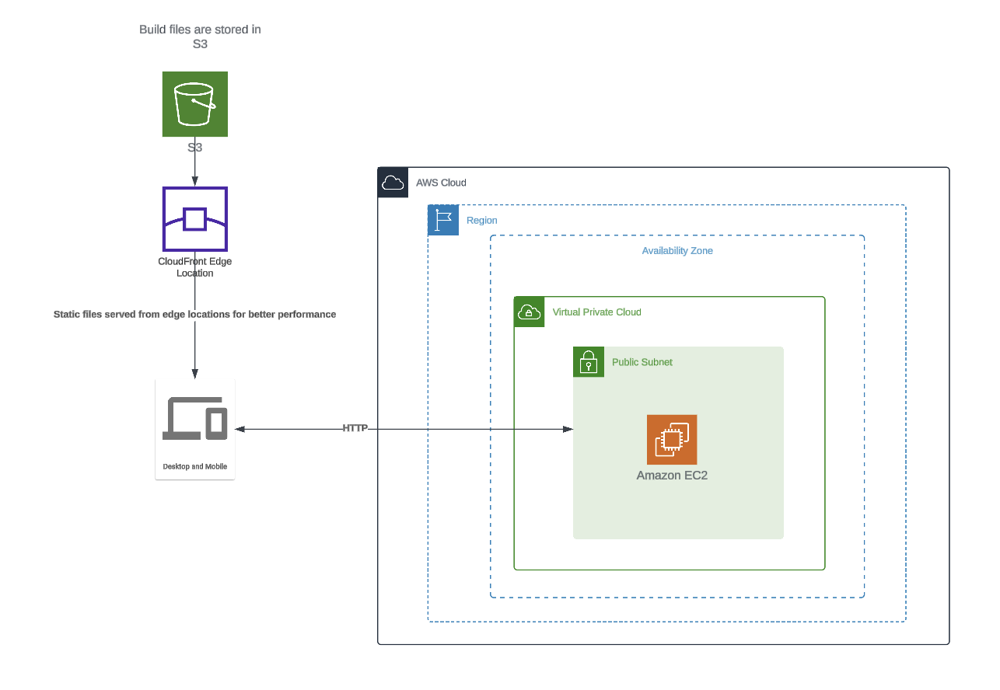

# Roulettech_backend

## Description

This project is a backend implementation for the RouletteCH application. It provides the necessary APIs and functionalities to support the frontend of the application.

## Installation

1. Clone the repository: `git clone https://github.com/your-username/roulettech_backend.git`
2. Navigate to the project directory: `cd roulettech_backend`
3. Install the dependencies: `pip install -r requirements.txt`

## include DB details:

1. open `roulettech_backend/mysite/mysite/settings.py`
2. At line 93 `add mongoDB connection string`

## Migrate Db schema

1. Navigate to workingdir: `cd roulettech_backend/mysite`
1. `python manage.py makemigrations `
1. `python manage.py migrate`

## Usage

1. Navigate : `cd roulettech_backend/mysite`
2. Start the server: `python manage.py runserver`
3. Access the APIs at `http://localhost:8000`

## API Documentation

For detailed information on the available APIs and their usage, please refer to the [API documentation](openapi.yml).

## Additional details (docker image, EC2 deployment script)

### Deploy.sh

The `deploy.sh` script is used for automating the deployment process of the RouletteCH backend application. It contains the necessary commands and configurations to deploy the application to an EC2 instance. The script includes steps such as copying project files, installing dependencies, building the Docker image, and running the container.

### Dockerfile

The `Dockerfile` is the text file that contains the set of instructions for building a Docker image. It specifies the base image, sets up the environment, installs dependencies, and defines the commands to run when the container is started. The Dockerfile is used to create a reproducible and isolated environment for running the RouletteCH backend application.

### Deployment method:

## License

This project is licensed under the [MIT License](LICENSE).

## Author

(Varun Bharathi Jayakumar)[https://github.com/varun-jayakumar]
